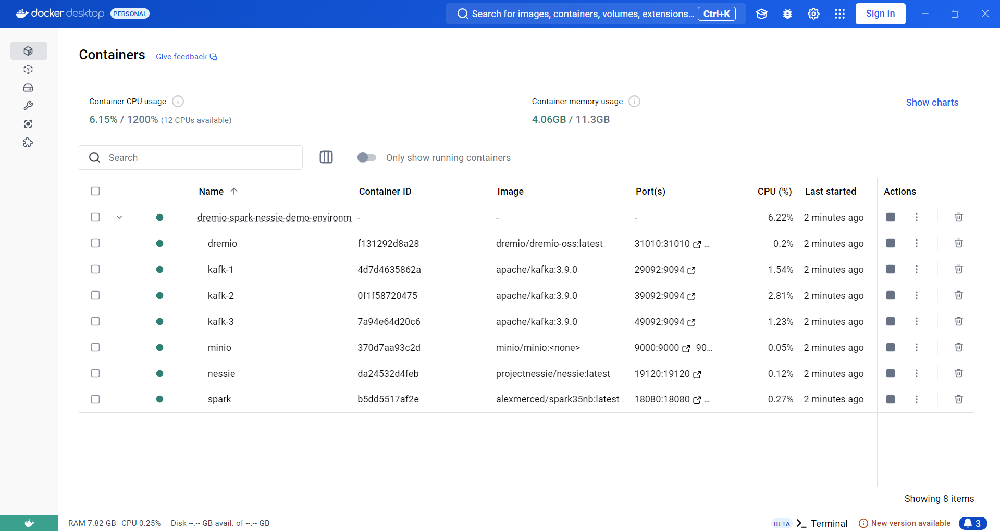

# Real-time E-commerce Monitoring Project with Kafka, Spark, Iceberg, Nessie, MinIO, Dremio & Streamlit

This project demonstrates how to build a data processing pipeline and a near real-time monitoring dashboard for E-commerce operations. The system collects events (orders, clicks, errors), processes them using Spark Structured Streaming, stores the data in Apache Iceberg tables managed by Nessie on MinIO, queries the data via Dremio, and displays the results on an interactive dashboard using Streamlit.

**Main Goals:**

* Track key business performance indicators (KPIs) such as order count, revenue, active users, and error rates almost instantly.
* Early detection of basic anomalies (e.g., critical system errors).
* Provide quick access to detailed data (latest orders, errors).

## Overall Architecture

The main data flow of the system is as follows:

1.  **Ingestion:** Source applications (simulated by Python scripts) send events to topics on **Kafka**.
2.  **Processing:** **Spark Structured Streaming** reads data from Kafka, performs transformations, calculates aggregations over time windows, and performs simple alert detection.
3.  **Storage & Catalog:** Processed data is written to **Apache Iceberg** tables. Table metadata (schema, snapshots, file locations) is managed by the **Nessie Catalog** server, while the actual data files (Parquet) are stored on **MinIO** (S3-compatible).
4.  **Querying:** **Dremio** connects to Nessie to query data in Iceberg tables using SQL.
5.  **Visualization:** **Streamlit** connects to Dremio via **Arrow Flight** to fetch data and display an interactive dashboard for users.


## Technology Stack

* **Apache Kafka:** Distributed message queue system, serving as the central event hub. (Using KRaft mode).
* **Apache Spark (Structured Streaming):** Distributed data processing and streaming framework.
* **MinIO:** S3-compatible object storage, acting as the Data Lake backend.
* **Nessie:** Iceberg Catalog server, managing metadata and providing ACID transactions, data versioning.
* **Apache Iceberg:** Open-source table format for large datasets on Data Lakes.
* **Dremio:** High-performance SQL Query Engine for Data Lakehouses.
* **Streamlit:** Python framework for building interactive data web applications.
* **Apache Arrow Flight:** High-performance data transfer protocol between Dremio and Streamlit.
* **Docker & Docker Compose:** For packaging and running the infrastructure components.
* **Python:** Main programming language for the Spark job, producers, and Streamlit dashboard.

## Main Functions

* Collect order, click, and system error data in real-time.
* Process data streams with Spark to clean, transform, and calculate aggregated metrics (KPIs) per minute, over time windows.
* Store structured and aggregated data in Iceberg tables on MinIO, with metadata managed by Nessie.
* Detect and log simple alerts (e.g., FATAL errors).
* Query near real-time data using SQL via Dremio.
* Display an interactive dashboard with KPIs, trend charts, alert lists, and latest activity logs using Streamlit.

## Project Structure

```text
.
├── docker-compose.yml          # Defines infrastructure services (Kafka, Spark, Nessie, MinIO, Dremio)
├── spark-apps/                 # Spark processing code
│   └── streaming_processor.py  # PySpark stream processing script
├── producers/                  # Data source simulation code
│   ├── producer_orders.py
│   ├── producer_clicks.py
│   ├── producer_errors.py
│   └── requirements.txt        # Python requirements for producers
├── dashboard/                  # Dashboard application code
│   ├── dashboard.py
│   └── requirements.txt        # Python requirements for dashboard
├── .gitignore                  # Files/directories ignored by Git
├── images/                     # Directory for README images
│   └── architecture.png        # Example diagram image name
├── nessie-data/                # (Auto-generated, ignored by .gitignore)
├── minio-data/                 # (Auto-generated, ignored by .gitignore)
└── README.md                   # Guide 
```

## Installation and Running Guide

**Prerequisites:**

* Docker
* Docker Compose
* Python 3.x (virtual environment recommended - venv)
* `pip` (Python package installer)

**Steps:**

1.  **Clone Repository:**
    ```bash
    git clone <your_repository_url>
    cd <repository_directory_name>
    ```

2.  **Start Docker Infrastructure:**
    * Open a terminal in the project's root directory.
    * Run the command: `docker-compose up -d`
    * Wait a few minutes for all services to start completely. You can check the status with `docker-compose ps`. Ensure MinIO has finished its entrypoint script to create the bucket.

        #### Docker Container Status
        
        After running `docker-compose up -d`, you can check the status of the containers using Docker Desktop or the command `docker-compose ps`. The image below shows the main services that are currently running:
        
        

3.  **Configure Dremio:**
    * Access the Dremio Web UI: `http://localhost:9047`
    * On the first visit, create an administrator account (e.g., user `dremio`, password `dremio123` - **should change the password**).
    * In the Dremio interface, navigate to **Sources** (bottom left corner).
    * Click the **Add Source** button (plus sign) -> Select **Nessie**.
    * Fill in the following information:
        * **Name:** Give the source a name (e.g., `nessie_minio_catalog` - **important:** must match the `ICEBERG_CATALOG_NAME` variable in the Python files and the Dremio source name in `dashboard.py`).
        * **Endpoint URL:** `http://nessie:19120/api/v2`
        * **Authentication:** Select "None".
    * Switch to the **Storage** tab:
        * **AWS root path:** `warehouse`
        * **AWS Access Key:** `admin` (MinIO user from docker-compose)
        * **AWS Access Secret:** `password` (MinIO password from docker-compose)
    * Click on **Advanced Options** (still in the Storage tab):
        * Check the box **"Enable compatibility mode (allow S3-compatible storage)"**.
        * In the **Connection Properties** section, click **Add Property** and add 3 properties:
            * `fs.s3a.endpoint` : `minio:9000`
            * `fs.s3a.path.style.access` : `true`
            * `dremio.s3.compat` : `true`
        * Uncheck the "Encrypt connection" box.
    * Click **Save**. Dremio will connect to Nessie and MinIO. You should see the `ecommerce_db` database (which will be created by Spark later) appear under this source after the Spark job runs.

4.  **Run Kafka Producers:**
    * Open **3 separate terminals** on your host machine, in the project's root directory.
    * **(Recommended)** Create and activate a Python virtual environment:
        ```bash
        # Terminal 1, 2, 3:
        python -m venv venv
        # Windows:
        .\venv\Scripts\activate
        # MacOS/Linux:
        source venv/bin/activate
        ```
    * Install the Kafka library for Python (only needs to be done once per virtual environment):
        ```bash
        # Terminal 1, 2, 3 (after activating venv):
        pip install -r producers/requirements.txt
        ```
    * Run the producers:
        ```bash
        # Terminal 1:
        python producers/producer_orders.py

        # Terminal 2:
        python producers/producer_clicks.py

        # Terminal 3:
        python producers/producer_errors.py
        ```
    * Leave these terminals running to continuously generate data.

5.  **Run Spark Job:**
    * Access the JupyterLab interface of the Spark container: `http://localhost:8888`
    * Use the JupyterLab interface to upload the `spark-apps/streaming_processor.py` file into the `/workspace/` directory.
    * Open a new Terminal window within JupyterLab (File -> New -> Terminal).
    * **Important:** Set the necessary environment variables for the `spark-submit` command:
        ```bash
        export SPARK_VERSION=3.5.0 # Or the Spark version you are using if different
        export ICEBERG_VERSION=1.4.2
        export NESSIE_VERSION=0.75.0
        ```
    * Run the `spark-submit` command (ensure there are no syntax errors or extra characters):
        ```bash
        /opt/spark/bin/spark-submit \
        --packages org.apache.spark:spark-sql-kafka-0-10_2.12:${SPARK_VERSION},\
        org.apache.iceberg:iceberg-spark-runtime-3.5_2.12:${ICEBERG_VERSION},\
        org.apache.iceberg:iceberg-aws-bundle:${ICEBERG_VERSION},\
        org.projectnessie.nessie-integrations:nessie-spark-extensions-3.5_2.12:${NESSIE_VERSION} \
        --conf spark.sql.catalog.nessie_minio_catalog.io-impl=org.apache.iceberg.aws.s3.S3FileIO \
        --conf spark.sql.catalog.nessie_minio_catalog.s3.endpoint=http://minio:9000 \
        --conf spark.sql.catalog.nessie_minio_catalog.s3.path-style-access=true \
        --conf spark.hadoop.fs.s3a.path.style.access=true \
        /workspace/streaming_processor.py
        ```
    * Monitor the output in the JupyterLab terminal. You should see messages about Spark Session initialization, Namespace creation, Table creation, and then "All streaming jobs started. Awaiting termination...".
    
        #### Spark Job Monitoring
        
        After submitting the Spark job, you can monitor its progress and performance via the Spark UI (typically accessible at `http://localhost:8080`). The "Structured Streaming" tab provides real-time statistics for each active streaming query writing data to Iceberg. The image below shows all queries running successfully and processing data:
        
        
        
        *(Key metrics like Input Rate and Processing Rate should be monitored here to assess throughput and potential bottlenecks.)*

        #### Data Storage on MinIO
        
        The Spark streaming job writes processed data into Apache Iceberg tables. The actual data files (Parquet) and metadata files (.metadata.json, manifests) for these tables are stored as objects within the `warehouse` bucket (`http://localhost:9001`) on the MinIO server. The following screenshot shows the directory structure created by Iceberg within the bucket:
        
        
        
        *(You can observe directories corresponding to tables like `orders_processed`, `clicks_processed`, `orders_revenue_per_minute`, etc.)*
        
        #### Querying Data via Dremio
        
        After Spark writes data to the Iceberg tables and Nessie manages the metadata, Dremio can be configured to connect to the Nessie catalog as a data source. Dremio can then discover and allow users to query these Iceberg tables using SQL. The screenshot below shows the tables within the `ecommerce_db` namespace listed in the Dremio UI:
        
        
        
        *(You can see all the tables like `orders_processed`, `clicks_processed`, `orders_revenue_per_minute`, etc., ready to be queried.)*


6.  **Run Streamlit Dashboard:**
    * Open a **new** terminal on your host machine, in the project's root directory.
    * Reactivate the virtual environment (if you closed the previous terminal):
        ```bash
        # Windows:
        .\venv\Scripts\activate
        # MacOS/Linux:
        source venv/bin/activate
        ```
    * Install the necessary libraries for Streamlit:
        ```bash
        pip install -r dashboard/requirements.txt
        ```
    * **Double-check the `dashboard.py` file:** Ensure the `DREMIO_USER`, `DREMIO_PASSWORD`, and `DREMIO_NESSIE_SOURCE` variables at the beginning of the file match the Dremio login credentials you created and the Source name you set in the Dremio UI.
    * Run the Streamlit application:
        ```bash
        streamlit run dashboard/dashboard.py
        ```
    * Open your browser and navigate to `http://localhost:8501`. You should see the dashboard displaying data updated in near real-time.

        #### Final Dashboard
        
        The end result is an interactive web dashboard built with Streamlit. It connects to Dremio via Arrow Flight to fetch near real-time data processed by the Spark/Iceberg/Nessie pipeline and visualizes key metrics, trends, recent activities, and alerts:
        
        

## Troubleshooting

* **Kafka Producer Errors (`KafkaTimeoutError`, `NoBrokersAvailable`):** Re-check if `KAFKA_ADVERTISED_LISTENERS` in `docker-compose.yml` has been correctly changed to `PLAINTEXT://localhost:xxxxx` corresponding to the port mapped to the host. Ensure Kafka brokers have fully started.
* **Spark Errors (`unresolved dependency`, `NoSuchMethodError`, `ClassNotFoundException`):** Usually related to library conflicts. Ensure you are using the correct `--packages` as in the final `spark-submit` command (especially `iceberg-aws-bundle`). Clearing the Ivy cache (`/root/.ivy2/cache` inside the Spark container) might help in some cases (`docker exec spark rm -rf /root/.ivy2/cache`).
* **Spark Error (`NoSuchTableException`):** Ensure the `streaming_processor.py` script includes `CREATE TABLE IF NOT EXISTS` commands for all target tables *before* calling `writeStream`.
* **Spark Error (`S3Exception: Status Code 301`, `Forbidden`, `Access Denied` or similar S3 connection issues):** Ensure the following `--conf` configurations are correctly set in the `spark-submit` command:
    * All `spark.sql.catalog.nessie_minio_catalog.*` settings (especially `warehouse`, `io-impl`, `s3.endpoint`, `s3.path-style-access`).
    * All `spark.hadoop.fs.s3a.*` settings (especially `access.key`, `secret.key`, `endpoint`, `path.style.access`, `impl`).
    * (Replace `nessie_minio_catalog` with your catalog name if different). Verify credentials (`admin`/`password`) match MinIO's settings. Ensure the `warehouse` bucket exists in MinIO (should be created by the entrypoint script).
* **Streamlit Error (`Column 'end' not found`):** Ensure SQL queries in `dashboard.py` use column names `window_start` and `window_end` instead of `start` and `end` for the metrics tables.
* **Streamlit Error (`TO_TIMESTAMP does not support operand types (TIMESTAMP)`):** Remove unnecessary `TO_TIMESTAMP()` functions in the SQL queries of `dashboard.py` when the column is already a TIMESTAMP type.
* **Streamlit Error (`ArrowIOError`, `Connection refused`):** Check if the Dremio service is running (`docker-compose ps`). Verify `DREMIO_FLIGHT_HOST`, `DREMIO_FLIGHT_PORT`, `DREMIO_USER`, `DREMIO_PASSWORD` in `dashboard.py`. Ensure Arrow Flight is enabled in Dremio (Admin -> Support Settings -> `dremio.flight.enabled` should be true, which is the default).

## Potential Improvements

* Implement more complex anomaly detection logic in Spark (e.g., comparing against moving averages, standard deviations).
* Use Kafka Connect and Debezium to capture Change Data Capture (CDC) data from real databases instead of simulated producers.
* Optimize Spark Streaming performance (Kafka topic partitioning, Spark executor/memory configuration).
* Add more metrics and charts to the Streamlit dashboard.
* Deploy the system on a cloud environment or Kubernetes instead of local Docker Compose.